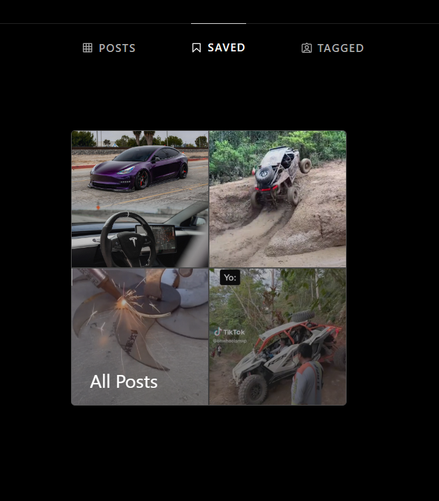
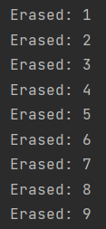

# Instagram Post Unsaver

## Description

Instagram_post_unsaver  is a Python program that uses [Selenium](https://www.selenium.dev/documentation/webdriver/getting_started/install_library/)
 to automatically unsave all the posts saved on your Instagram account.

Have you ever found yourself with hundreds or even thousands of saved posts on 
Instagram, and wished there was an easy way to unsave them all at once? 
With Instagram Unsave All, you can do just that with a few clicks.


## How it works
Instagram Unsave All uses the Selenium WebDriver to automate the 
process of logging into your Instagram account, navigating to the 
saved posts section, and unsave each post one by one <br/><br/>


<p align="center">

</p>


### Required External Libraries
- [Selenium](https://www.selenium.dev/documentation/webdriver/getting_started/install_library/)
- [Chrome WebDriver Manager](https://pypi.org/project/webdriver-manager/)
- [Python 3.7 or higher](https://www.python.org/downloads/release/python-370/)

### Required Imports

``` python
from webdriver_manager.chrome import ChromeDriverManager
from selenium.webdriver.support.ui import WebDriverWait
from selenium.webdriver.common.by import By
from selenium import webdriver
import time
```

### Instructions
- Open IDE of choice
- Open Instagram_unsaver.py
- Run!

### Output Text Example



> Disclamer:
> Please note that using Instagram Unsave All may violate Instagram's terms of service, as it automates a process that is meant to be done manually. Use this program at your own risk, and be aware that Instagram may take action against accounts that use automation tools.
> 
> Increase time.sleep on line 80 when unsaving over 250 posts to 
> <br/>prevent potential Instagram Auto-Detection that may restrict your account 

